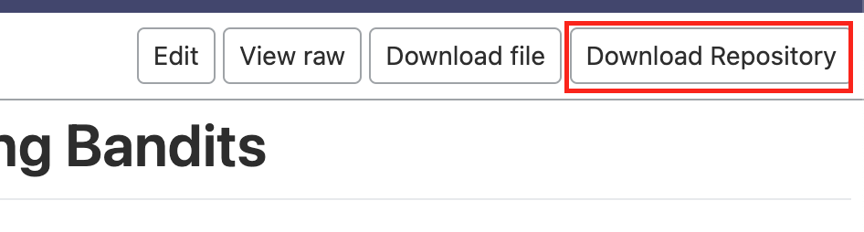

# Direct Preference-Based Evolutionary Multi-Objective Optimization with Dueling Bandits

This is the code for the paper "Direct Preference-Based Evolutionary Multi-Objective Optimization with Dueling Bandits". 

## Installation
Our $\texttt{D-PBEMO}$ package is now available on Windows, Linux and MacOS. There are a few steps needed to install it as below.

### Dependency

1. [**CMake**](https://cmake.org/)

   CMake is an open-source, cross-platform family of tools designed to build, test and package software. $\texttt{D-PBEMO}$ uses it to generate the build system files on different platforms. You can download it from [here](https://cmake.org/download/). The minimum needed version of CMake is 3.10. For more information please refer to the [CMake documentation](https://cmake.org/documentation/).

2. [**Visual Studio 2019**](https://visualstudio.microsoft.com/) (for windows)

   Visual Studio (VS) is an Integrated Development Environment (IDE) for C++. Our $\texttt{D-PBEMO}$ generates the VS project file on Windows to compile the source code. You can download it from [here](https://visualstudio.microsoft.com/downloads) .

3. [**Gnuplot**](http://www.gnuplot.info/) (for windows)

   Gnuplot is a portable command-line driven graphing utility. EMOC uses it to provide some visualization functions. The installation for Linux and MacOS is handled in the build script files. For windows, users need to install it from [here](https://sourceforge.net/projects/gnuplot/files/gnuplot/5.0.1/). We recommend to use the version 5.0.1. 

4. [**Git**](https://git-scm.com/) (optional)

   You can use git to download the DPBEMO source code from github conveniently or just click the download button on the $\texttt{D-PBEMO}$ github page directly.

5. [**Armadillo**](https://arma.sourceforge.net/)

   Armadillo is a high quality linear algebra library (matrix maths) for the C++ language, aiming towards a good balance between speed and ease of use. 

6. 

### Get the Source Code

#### **Download from github page**

Go to the [$\texttt{D-PBEMO}$ github page](https://anonymous.4open.science/r/DPBEMO/) and click the option 'Download Reository':



and unzip the file wherever you want.


### Build

When you have got the source code, go to the root directory of $\texttt{D-PBEMO}$. We have prepared some script files for the ease of building $\texttt{D-PBEMO}$, our project is named EMOC in the following sections.

#### **For Windows**

Double-click the file 'build_window.bat', it will detect the Visual Studio installed on your system and generate the project file automatically. After executing the '.bat' file, go to the **'/build'** directory and open the 'EMOC.sln' file with Visual Studio.

You can travel the code and run it in VS directly or find the executable file **'EMOC.exe'** in root directory after compiling it.

#### **For Linux and MacOS**

Open the terminal and change the current directory to the root directory of EMOC. Build EMOC with the following command:

**Linux:**

```bash
bash ./build_linux.sh
```

**MacOS:**

```bash
bash ./build_macos.sh
```

The executable file **'EMOC'** will appear in the root directory when building successfully.


## How to use $\texttt{D-PBEMO}$

### Graphic User Interface mode

When EMOC has been built successfully, go to the directory of the executable file and open the terminal. Enable the user interface mode with the following command:

`./EMOC -g`

For windows, change the '.**/EMOC**' to '**./EMOC.exe**'


### Command Line Mode

Although the interface mode is available, we recommend you use our $\texttt{D-PBEMO}$ in the command line especially for users who don't have a display screen (like on a remote server) or want to play large-scale experiments.

#### A Simple Case

Go to the directory of executable file and open the terminal. User can run EMOC with default parameters by just:

`./EMOC`

For windows, change the '**./EMOC**' to '**EMOC.exe**'. Some settings and results information will be printed in the terminal:


### User $\texttt{D-PBEMO}$ in Python


