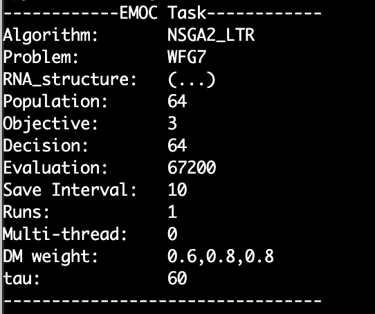

# Direct Preference-Based Evolutionary Multi-Objective Optimization with Dueling Bandits

This is the code for the paper "Direct Preference-Based Evolutionary Multi-Objective Optimization with Dueling Bandits". 

## Installation
Our $\texttt{D-PBEMO}$ package is now available on Windows, Linux and MacOS. There are a few steps needed to install it as below.

### Dependency

1. [**CMake**](https://cmake.org/)

   CMake is an open-source, cross-platform family of tools designed to build, test and package software. $\texttt{D-PBEMO}$ uses it to generate the build system files on different platforms. You can download it from [here](https://cmake.org/download/). The minimum needed version of CMake is 3.10. For more information please refer to the [CMake documentation](https://cmake.org/documentation/).

2. [**Visual Studio 2019**](https://visualstudio.microsoft.com/) (for windows)

   Visual Studio (VS) is an Integrated Development Environment (IDE) for C++. Our $\texttt{D-PBEMO}$ generates the VS project file on Windows to compile the source code. You can download it from [here](https://visualstudio.microsoft.com/downloads) .

3. [**Gnuplot**](http://www.gnuplot.info/) (for windows)

   Gnuplot is a portable command-line driven graphing utility. EMOC uses it to provide some visualization functions. The installation for Linux and MacOS is handled in the build script files. For windows, users need to install it from [here](https://sourceforge.net/projects/gnuplot/files/gnuplot/5.0.1/). We recommend to use the version 5.0.1. 

4. [**Git**](https://git-scm.com/) (optional)

   You can use git to download the DPBEMO source code from github conveniently or just click the download button on the $\texttt{D-PBEMO}$ github page directly.

5. [**Armadillo**](https://arma.sourceforge.net/)

   Armadillo is a high quality linear algebra library (matrix maths) for the C++ language, aiming towards a good balance between speed and ease of use. 

6. 

### Get the Source Code

#### **Download from github page**

Go to the [$\texttt{D-PBEMO}$ github page](https://anonymous.4open.science/r/DPBEMO/) and click the option 'Download Reository':


and unzip the file wherever you want.


### Build

When you have got the source code, go to the root directory of $\texttt{D-PBEMO}$. We have prepared some script files for the ease of building $\texttt{D-PBEMO}$, our project is named EMOC in the following sections.

#### **For Windows**

Double-click the file 'build_window.bat', it will detect the Visual Studio installed on your system and generate the project file automatically. After executing the '.bat' file, go to the **'/build'** directory and open the 'EMOC.sln' file with Visual Studio.

You can travel the code and run it in VS directly or find the executable file **'EMOC.exe'** in root directory after compiling it.

#### **For Linux and MacOS**

Open the terminal and change the current directory to the root directory of EMOC. Build EMOC with the following command:

**Linux:**

```bash
bash ./build_linux.sh
```

**MacOS:**

```bash
bash ./build_macos.sh
```

The executable file **'EMOC'** will appear in the root directory when building successfully.


## How to use $\texttt{D-PBEMO}$

### Graphic User Interface mode

When EMOC has been built successfully, go to the directory of the executable file and open the terminal. Enable the user interface mode with the following command:

`./EMOC -g`

For windows, change the '.**/EMOC**' to '**./EMOC.exe**'


### Command Line Mode

Although the interface mode is available, we recommend you use our $\texttt{D-PBEMO}$ in the command line especially for users who don't have a display screen (like on a remote server) or want to play large-scale experiments.

#### A Simple Case

Go to the directory of executable file and open the terminal. User can run EMOC with default parameters by just:

`./EMOC`

For windows, change the '**./EMOC**' to '**EMOC.exe**'. Some settings and results information will be printed in the terminal:




 After executing, the optimized population results will be saved in **./output/** directory.

#### Run EMOC With Different Parameters

In CMD mode, users can also set different parameters of this run, an example of running our proposed  $\texttt{D-PBEMO}$ algorithm is shown below:

`./EMOC -a DPBEMO_MOEAD -p DTLZ1 -M 3 -D 7 -N 64 -e 35200 -r 20 -W 0.3,0.3,0.2 -q 25`

This command sets the algorithm to DPBEMO_MOEAD ($\texttt{D-PBMOEA/D}$ in paper), the problem to DTLZ1, the max evaluation to $35200$ and the population number to $64$. All acceptable parameters are listed in the following table:

| Parameter Name            | Description                                    | Default Value |
| ------------------------- | ---------------------------------------------- | ------------- |
| -h, --help                | Print some helpful information in the terminal | None          |
| -g, --gui                 | Run EMOC in GUI mode                           | False         |
| -a, --algorithm           | Algorithm name                                 | NSGA2         |
| -p, --problem             | Problem name                                   | ZDT1          |
| -N, --pop                 | Population size                                | 100           |
| -M, --obj                 | Problem's objective dimension                  | 2             |
| -D, --dec                 | Problem's decision variable dimension          | 30            |
| -e, --evaluation          | Evaluation number for each run                 | 25000         |
| -i, --interval            | Population save interval                       |               |
| -r, --run                 | The number of runs                             | 1             |
| -multithread              | Whether open multi-thread mode                 | False         |
| -t, --thread              | Thread number in multi-thread mode             | 0             |
| -W, weightStringType      | Weight for DM                                  | 0,0           |
| -q, --elicitationInterval | Frequency of Queries                           | 0             |
| -I,--rnaID                | ID of RNA                                      | 0             |

#### Available Algorithms and Problems

The available algorithms and problems in EMOC are listed below. All available algorithms are in '**./src/algorihtm/**', and problems in  '**./src/problem/**'. You can also create your own algorithm in the directory. Note after createing your own algorithm, remember to register it in '**./src/algorithm/algorithm_head_collect.cpp**'.

**Algorithm:**

| Decompostion Based | Dominanced Based | Indicator Based | Constraint | Single Objective      |
| ------------------ | ---------------- | --------------- | ---------- | --------------------- |
| MOEAD              | NSGA2            | IBEA            | CNSGA2     | GA                    |
| MOEADDE            | NSGA3            | HypE            | CMOEAD     | DifferentialEvolution |
| MOEADDRA           | SPEA2            | SMSEMOA         | CTAEA      | SA                    |
| MOEADGRA           | SPEA2            | R2_IBEA         |            |                       |
| MOEADIRA           | SPEA2SDE         | R2_IBEA_LTR     |            |                       |
| ENSMOEAD           | tDEA             | DPBEMO_R2_IBEA  |            |                       |
| MOEADCDE           | NSGA2PPL         |                 |            |                       |
| MOEADSTM           | NSGA2_LTR        |                 |            |                       |
| MOEADPAS           | NEMO_0           |                 |            |                       |
| MOEADM2M           | DPBEMO_DTS       |                 |            |                       |
| MOEADD             | DPBEMO_NSGA2     |                 |            |                       |
| MOEADDYTS          |                  |                 |            |                       |
| MOEADFRRMAB        |                  |                 |            |                       |
| MOEADUCB           |                  |                 |            |                       |
| RVEA               |                  |                 |            |                       |
| MOEADPLVF          |                  |                 |            |                       |
| MOEAD_LTR          |                  |                 |            |                       |
| IEMOD              |                  |                 |            |                       |
| MOEADPBO           |                  |                 |            |                       |
| DPBEMO_MOEAD       |                  |                 |            |                       |

**Problems:**

| Single Objective | Multi Objective   | Many Objective   | Constraint    | Reinforcement Learning | Protein |
| ---------------- | ----------------- | ---------------- | ------------- | ---------------------- | ------- |
| Sphere           | ZDT Series        | DTLZ Series      | CDTLZ Series  | Swimmer                | Antigen |
| Ackley           | UF Series         | MinusDTLZ Series | DCDTLZ Series |                        | RNA     |
| Rastrigin        | BT Series         | MDTLZ Series     |               |                        |         |
| TSP              | MOEADDE_F Series  | WFG Series       |               |                        |         |
| Knapsack         | IMMOEA_F Series   | LSMOP Series     |               |                        |         |
| ThreeHumpCamel   | MOEADM2M_F Series |                  |               |                        |         |
| Easom            |                   |                  |               |                        |         |
| StyblinskiTang   |                   |                  |               |                        |         |


### User $\texttt{D-PBEMO}$ in Python

To increase the flexibility of EMOC, we also provide a method to compile the source code to a python dynamic link library (DLL). So that EMOC can be used in python language too.

#### Build

Open your platform's script file with a text editor and find the row begin with `cmake -DBUILD_PYTHOn_DLL=OFF`. Change the `OFF` to `ON`. For example:

```bash
# build_linux.sh

# download dependencies
sudo apt install gnuplot gnuplot-x11
sudo apt install xorg-dev
sudo apt install mesa-common-dev libgl1-mesa-dev

# build EMOC
mkdir build
cd build
cmake -DBUILD_PYTHON_DLL=ON ..
make -j4
```

Or you can also change your CMakeLists.txt:

```cmake
set(BUILD_PYTHON_DLL ON CACHE BOOL "Whether build python dll")
```

The following build steps are the same in installation section, just execute the script file directly. After building successfully, the DLL file '**EMOC.XXX.so**' (or '**EMOC.XXX.pyd**' on windows) will appear in '**./build**' directory. Rename it to '**EMOC.so**' (or '**EMOC.pyd**') and put it with your python file.

#### An Example

Here is an example of how to use the EMOC in python files.

```python
import EMOC

# create and set EMOC parameters
para = EMOC.EMOCParameters()
para.algorithm_name = "DPBEMO_MOEAD"
para.problem_name = "ZDT1"
para.population_num = 100
para.decision_num = 30
para.objective_num = 2
para.max_evaluation = 25000
para.output_interval = 10

# create EMOCManager instance and run it
EMOCManager = EMOC.EMOCManager()
EMOCManager.SetTaskParameters(para)
EMOCManager.Run()

# get the optimization results
result = EMOCManager.GetResult()
print("Population Number: ",result.pop_num)
print("Population Decisions: ",result.pop_decs)
print("Population Objectives: ",result.pop_objs)
```

In our experiment session, PSPs are run in python files, first you need to git clone the source code of PSP surrogate model. Here we reference the work ["PCM: Pareto Dominance Archive and Coordinated Selection Strategy-Based Many-Objective Optimizer for Protein Structure Prediction"](https://github.com/zhangzm0128/PCM-Protein-Structure-Prediction). 

In the root directory of PSP, create your own python file '**run.py**' (this 'run.py' is in ./python_example/):

```python
# define your own problem, 1ZDD for example
class PSP_1ZDD(EMOC.Problem):
    def __init__(self, dec_num, obj_num, config, energy_config, protein_config, protein_status, coder):
        super(PSP_1ZDD, self).__init__(dec_num, obj_num)
        # init constraint of each decision num
        lower_bound = [-180] * dec_num
        lower_bound[0] = 0
        self.lower_bound = lower_bound
        self.upper_bound = [180] * dec_num
        self.config = config
        self.energy_config = energy_config
        self.protein_config = protein_config
        self.protein_status = protein_status
        self.coder = coder
        # self.seq_save_path = []
        # self.protein_name = []
        

    def init_dec_protein(self, x):
        # init decision variable to protein structure
        protein = x
        self.protein_name = config['protein_params']['name']
        self.seq_save_path = config['protein_params']['second_struct_file']
        # data_path = os.path.join(protein_save_path, protein_name + '_' + str(x))
        protein = Protein(self.obj_num, protein_status, coder)
        return protein

    
    def CalObj(self, ind):
        x = ind.dec
        protein = []
        new_protein = self.init_dec_protein(x)
        protein.append(coder.decoder_from_dec(self.seq_save_path, x, new_protein))
        # print(protein[0].res.angle)
        print(protein)
        # TODO
        config = json.loads(config_file)
        protein_config = json.loads(protein_config_file)
        energy_config = json.loads(energy_config_file)

        root = config['paths']['root']
        second_struct_file_path = config['protein_params']['second_struct_file']
        max_thread = config['energy_params']['max_thread']
        print(energy_config)
        energy = Energy(energy_config, root, energy_temp_save_path, protein_name, second_struct_file_path, max_thread, protein[0])
        energy.calculate_energy(protein)
        energy.stop()
        ind.obj = protein[0].obj
        
# set PSP parameters
parser = argparse.ArgumentParser()


parser.add_argument('--config', type=str, default='config/config_knea.json',
                    help='the path of global config file.')
parser.add_argument('--protein_config', type=str, default='protein_config.json',
                    help='the path of protein config file.')
parser.add_argument('--energy_config', type=str, default='config/energy_config.json',
                    help='the path of energy function config file.')
parser.add_argument('--checkpoint', type=str, default=None,
                    help='the path of checkpoint and program will run checkpoint data.')
parser.add_argument('--mode', type=str, default=None)


args = parser.parse_args()
checkpoint = args.checkpoint
# set Logger and init logging save path
logging = LoggerWriter(args)
logs_root, energy_temp_save_path, protein_save_path, config_save = logging.init_path()

# read configuration file
config_file = open(os.path.join(config_save, 'config.json'), 'r').read()
config = json.loads(config_file)

protein_config_file = open(os.path.join(config_save, 'protein_config.json'), 'r').read()
protein_config = json.loads(protein_config_file)

energy_config_file = open(os.path.join(config_save, 'energy_config.json'), 'r').read()
energy_config = json.loads(energy_config_file)

# init parameters
second_struct_file_path = config['protein_params']['second_struct_file']
protein_status = config['protein_params']['status']
protein_name = config['protein_params']['name']
root = config['paths']['root']

pop_size = config['algo_params']['pop_size']
max_gen = config['algo_params']['max_gen']

num_obj = config['energy_params']['number_objective']
max_thread = config['energy_params']['max_thread']

# set coder and energy
coder = Coding(protein_config, protein_status)

proteins = []

# init protein
if checkpoint == None:
    # generate proteins
    for x in range(pop_size):
        new_protein = Protein(num_obj, protein_status, coder)
        proteins.append(coder.decoder_from_seq(second_struct_file_path, new_protein))

    # calculate energy of init proteins
    start_time = time.time()
    #energy.calculate_energy(proteins)
    #logging.write(proteins, coder, config['algo_params']['save_all'], 0)
else:
    for x in range(pop_size):
        data_path = os.path.join(protein_save_path, protein_name + '_' + str(x))
        new_protein = Protein(num_obj, protein_status, coder)
        proteins.append(coder.decoder_from_logger(data_path, new_protein))
energy = Energy(energy_config, root, energy_temp_save_path, protein_name, second_struct_file_path, max_thread, proteins[0])
energy.calculate_energy(proteins)
logging.write(proteins, coder, config['algo_params']['save_all'], 0)

end_time = time.time()
print('total time', end_time - start_time)

init_pop = []
for pro in proteins:
    for residue in pro.res:
        for ang in residue.angle:
            init_pop.append(ang)

init_pop = np.array(init_pop).reshape(len(proteins), -1)
print(init_pop)
print(init_pop.shape)
print(len(init_pop[0]))

algorithm = ['DPBEMO_NSGA2']
# algorithm = ['DPBEMO_NSGA2','MOEADPLVF', 'IEMO/D', 'MOEADPBO', 'DPBEMO_DTS', 'DPBEMO_MOEAD']
# create and set EMOC parameters
for alg in algorithm:
    para = EMOC.EMOCParameters()
    para.algorithm_name = alg
    para.population_num = pop_size
    para.objective_num = num_obj
    para.decision_num = len(init_pop[0])
    para.max_evaluation =  max_gen * pop_size
    para.output_interval = 10
    para.runs_num = 3
    if protein_name == '1ZDD':
        para.problem_name = "PSP_" + protein_name
        para.weight_DM = '297.18,-74.02,-27.73,-4604.18'
        myProblem = PSP(para.decision_num, para.objective_num, config, energy_config, protein_config, protein_status, coder)
    elif protein_name == '1K36':
        para.problem_name = "PSP_" + protein_name
        para.weight_DM = '431.51,-52.84,293.70,-5059.39'
        myProblem = PSP(para.decision_num, para.objective_num, config, energy_config, protein_config, protein_status, coder)
    elif protein_name == '2M7T':
        para.problem_name = "PSP_" + protein_name
        para.weight_DM = '269.76,-39.51,-10.82,-3313.84'
        myProblem = PSP(para.decision_num, para.objective_num, config, energy_config, protein_config, protein_status, coder)
    elif protein_name == '3P7K':
        para.problem_name = "PSP_" + protein_name
        para.weight_DM = '379.04,-104.15,-11.29,-6140.81'
        myProblem = PSP(para.decision_num, para.objective_num, config, energy_config, protein_config, protein_status, coder)
    elif protein_name == '3V1A':
        para.problem_name = "PSP_" + protein_name
        para.weight_DM = '392.22,-113.26,-69.84,-7128.48'
        myProblem = PSP(para.decision_num, para.objective_num, config, energy_config, protein_config, protein_status, coder)
    print('algorithm name', para.algorithm_name)
    print('problem_name', para.problem_name)
    print('population_num', para.population_num)
    print('max_evaluation', para.max_evaluation)
    print('objective num', para.objective_num)
    print('decision_num', para.decision_num)
    print('output_interval', para.output_interval)
    print('weight_DM', para.weight_DM)
    print('runs_num', para.runs_num)
    
    with open('./record.txt', 'a', encoding='utf-8') as w:
        w.write(time.asctime())
        w.write(para.algorithm_name + "\n")
        w.close() 
    para.SetProblem(myProblem)

    # set initial population
    para.SetInitialPop(init_pop)
    print("initialize successfully")

    # create EMOCManager instance and run it
    EMOCManager = EMOC.EMOCManager()
    EMOCManager.SetTaskParameters(para)
    EMOCManager.Run()
    energy.stop()
    # get the optimization results
    result = EMOCManager.GetResult()
    print("Population Number: ",result.pop_num)
    print("Population Decisions: ",result.pop_decs)
    print("Population Objectives: ",result.pop_objs)
      
```

Also, you can create a '**shell.py**' file run large-scale PSP experiments:

```python
import os
protein = ['1ZDD', '1K36', '2M7T', '3V1A', '3P7K']
for pro in protein:
  print(os.system(f'python run.py --config ./config/config_PCM_{pro}.json --energy_config ./config/energy_config.json --protein_config ./config/protein_config.json'))
```


